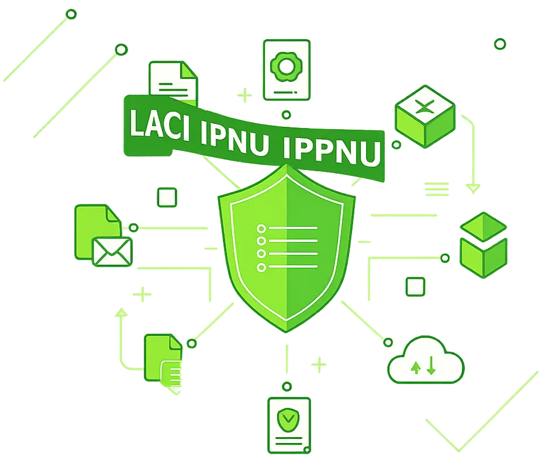

  

<h1 align="center">Laci Digital IPNU IPPNU</h1>

  Sistem administrasi dan pengarsipan digital terpusat bagi PC IPNU IPPNU Kabupaten Magetan.

  
  
  
  
  

---

## 📖 Tentang Aplikasi
**Laci** adalah ekosistem aplikasi terpusat yang dirancang khusus untuk memodernisasi dan mendigitalkan seluruh tata kelola administrasi organisasi IPNU (Ikatan Pelajar Nahdlatul Ulama) dan IPPNU (Ikatan Pelajar Putri Nahdlatul Ulama). Seluruh akses masuk (login) ke dalam aplikasi ini dan sistem turunannya sudah terintegrasi menggunakan akun **Single Sign-On (SSO)**.

## 🏗️ Arsitektur Sistem
Sejak versi `v0.3.0`, Laci telah bertransformasi dari sistem monolitik menjadi arsitektur modern yang terpisah (*Decoupled Architecture*) untuk menjamin performa, keamanan, dan skalabilitas:

- ⚙️ **Backend (Golang):** Berperan sebagai otak (REST API) yang memproses seluruh logika bisnis, transaksi *database* (melalui Prisma), dan sistem otentikasi.
- 💻 **Frontend Web (Next.js):** Menyajikan antarmuka (*User Interface*) berbasis web modern yang cepat dan responsif untuk para Admin/Pimpinan.
- 📱 **Mobile App (Flutter / React Native - *Preparation*):** Sistem telah didesain dengan modul `mobile/` dan API khusus yang siap diintegrasikan dengan aplikasi ponsel pintar (Android/iOS) di masa mendatang.

## ✨ Fitur Utama

### 1. 🔐 Login Terintegrasi (SSO)
Akses masuk (login) ke dalam sistem menggunakan akun Single Sign-On (SSO) terpusat.

### 2. 🗺️ Manajemen Struktur Wilayah
Sistem hierarki wilayah yang lengkap dan berjenjang. Pimpinan dapat mengelola, memantau, dan menambahkan struktur di bawahnya:
- **Pimpinan Cabang (PC)**
- **Pimpinan Anak Cabang (PAC)**
- **Pimpinan Ranting (PR) / Pimpinan Komisariat (PK)**

### 3. 👥 Manajemen & Verifikasi Anggota
Mengelola *database* anggota secara terpusat dengan sistem verifikasi berjenjang. Setiap pendaftaran anggota baru melalui sistem eksternal akan masuk ke Laci dalam status *PENDING* untuk kemudian diverifikasi (Diterima/Ditolak) oleh pimpinan yang berwenang.

### 4. 🪝 Integrasi Webhook Real-time
Laci dilengkapi dengan sistem *Webhook* cerdas. Setiap kali ada perubahan penting (misalnya: status anggota diverifikasi oleh Cabang), Laci akan secara otomatis (*real-time*) menembakkan data JSON ke *endpoint* sistem eksternal (seperti Web Sistem Anggota) agar data selalu sinkron di seluruh ekosistem aplikasi.

### 5. 📂 Pengarsipan & Pengajuan Berkas (E-Filing)
Sistem penyimpanan dokumen digital cerdas. Menggantikan proses manual pengajuan Surat Pengesahan (SP) dan pengarsipan berkas pimpinan menjadi sistem digital yang aman, terlacak, dan mudah diunduh kapan saja.

---

> [!NOTE]
> **Catatan Sejarah Evolusi Proyek:**
> Repositori ini (`laci-next-js-sso`) adalah generasi kedua dari sistem Laci Digital. Pada versi `v0.1.0` hingga `v0.2.0` sebelumnya, proyek ini dibangun menggunakan arsitektur monolitik murni (Fullstack Next.js) yang dapat Anda lihat pada repositori *legacy*: [Inur123/laci-next-js](https://github.com/Inur123/laci-next-js). Sejak `v0.3.0`, sistem dirombak dan dipisahkan menjadi struktur *microservice-ready* (Go + Next.js + Flutter) seperti yang Anda lihat sekarang.

---
*Dibangun dengan ❤️ untuk kemajuan pelajar Nahdlatul Ulama.*
